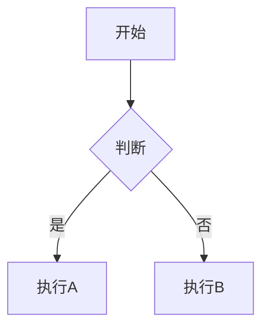

# Markdown 与渲染

Local Comment 的 Markdown 编辑器支持标准 Markdown 语法以及扩展功能。

## 语法参考 {#syntax}

### 基础语法

| 元素 | Markdown 语法 |
|------|---------------|
| 标题 | `# H1` `## H2` `### H3` |
| 粗体 | `**粗体**` |
| 斜体 | `*斜体*` |
| 引用 | `> 引用内容` |
| 有序列表 | `1. 第一项` |
| 无序列表 | `- 第一项` |
| 代码 | `` `code` `` |
| 代码块 | ` ```js\ncode\n``` ` |
| 链接 | `[标题](url)` |
| 图片 | `` |
| 分隔线 | `---` |
| 表格 | `\| A \| B \|` |

## Mermaid 图表 {#mermaid}

使用 ` ```mermaid ` 代码块插入流程图：

```markdown

```

<div class="callout callout-tip" data-user-level="advanced">
<strong>高级技巧：</strong>在预览区域，可以使用 <kbd>Ctrl</kbd> + 鼠标滚轮缩放 Mermaid 图表。支持手绘风格（可在设置中切换）。
</div>

## LaTeX 公式 {#latex}

使用 `$$` 包裹 LaTeX 公式：

```markdown
$$
E = mc^2
$$
```

行内公式使用 `$...$`：

```markdown
这是一个行内公式 $a^2 + b^2 = c^2$ 的示例。
```

## 代码高亮 {#highlight}

代码块支持语法高亮，在 fenced code block 中指定语言：

```markdown
```javascript
function hello() {
  console.log("Hello");
}
```
```

支持的语言包括但不限于：javascript, typescript, python, java, cpp, html, css, json, yaml, bash。

## 主题配置 {#theme}

在 VS Code: 设置中搜索 "local comment"，可以调整：

- **Markdown 预览字体大小**：默认跟随编辑器字体大小
- **代码高亮主题**：多种主题可选
- **Mermaid 主题**：默认、暗黑、森林、手绘等风格

<div class="callout callout-tip" data-user-level="daily">
<strong>日常配置：</strong>如果你经常使用 Mermaid，建议尝试「手绘风格」（hand drawn），让流程图看起来更轻松。
</div>
