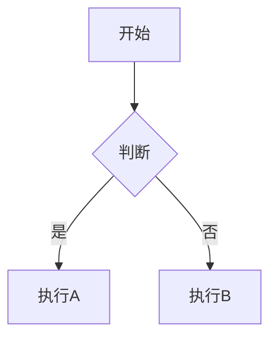

# Markdown 与渲染

Local Comment 提供完整的 Markdown 支持，包括编辑器内的注释、Markdown 文件的预览与导出。

## Markdown 文件预览与导出 {#file-preview}

**2.0 新增**：直接预览和导出 `.md` 文件，将文档与代码深度整合：

### 预览 Markdown 文件

- 在任意 `.md` 文件编辑器中，**右键选择「预览 Markdown」**
- 或使用命令面板执行 `Local Comment: Preview Markdown`
- 支持实时渲染：Mermaid 图表、LaTeX 公式、代码语法高亮
- 图表交互：支持缩放按钮（+/-）、<kbd>Ctrl</kbd> + 滚轮缩放、鼠标拖拽平移

### 导出为 HTML

- 在预览面板点击「导出 HTML」按钮
- 生成**自包含的 HTML 文件**（内嵌所有 CSS/JS/字体资源）
- 无需网络即可查看，便于分享和存档

### 在文档中引用代码标签

在 Markdown 文件中可以引用代码中的标签，实现文档与代码的关联：

```markdown
## 系统架构

配置加载模块：@configLoader
错误处理模块：@errorHandling
```

- 右键 → 「插入标签引用」快速插入 `@tagName`
- 预览时点击 `@tagName` **直接跳转到代码定义位置**

<div class="callout callout-tip">
<strong>知识管理工作流：</strong>用 Markdown 写设计文档 → 用 <code>@</code> 引用代码标签 → 一键预览 → 导出 HTML 分享给团队。所有标签链接在导出后依然可点击跳转。
</div>

## 语法参考 {#syntax}

### 基础语法

| 元素 | Markdown 语法 |
|------|---------------|
| 标题 | `# H1` `## H2` `### H3` |
| 粗体 | `**粗体**` |
| 斜体 | `*斜体*` |
| 引用 | `> 引用内容` |
| 有序列表 | `1. 第一项` |
| 无序列表 | `- 第一项` |
| 代码 | `` `code` `` |
| 代码块 | ` ```js\ncode\n``` ` |
| 链接 | `[标题](url)` |
| 图片 | `` |
| 分隔线 | `---` |
| 表格 | `\| A \| B \|` |

## Mermaid 图表 {#mermaid}

使用 ` ```mermaid ` 代码块插入流程图：

```markdown

```

<div class="callout callout-tip">
<strong>高级技巧：</strong>在预览区域，可以使用 <kbd>Ctrl</kbd> + 鼠标滚轮缩放 Mermaid 图表。支持手绘风格（可在设置中切换）。
</div>

## LaTeX 公式 {#latex}

使用 `$$` 包裹 LaTeX 公式：

```markdown
$$
E = mc^2
$$
```

行内公式使用 `$...$`：

```markdown
这是一个行内公式 $a^2 + b^2 = c^2$ 的示例。
```

## 代码高亮 {#highlight}

代码块支持语法高亮，在 fenced code block 中指定语言：

```markdown
```javascript
function hello() {
  console.log("Hello");
}
```
```

支持的语言包括但不限于：javascript, typescript, python, java, cpp, html, css, json, yaml, bash。

## 主题配置 {#theme}

在 VS Code: 设置中搜索 "local comment"，可以调整：

- **Markdown 预览字体大小**：默认跟随编辑器字体大小
- **代码高亮主题**：多种主题可选
- **Mermaid 主题**：默认、手绘等风格

<div class="callout callout-tip">
<strong>日常配置：</strong>如果你经常使用 Mermaid，建议尝试「手绘风格」（hand drawn），让流程图看起来更轻松。
</div>
