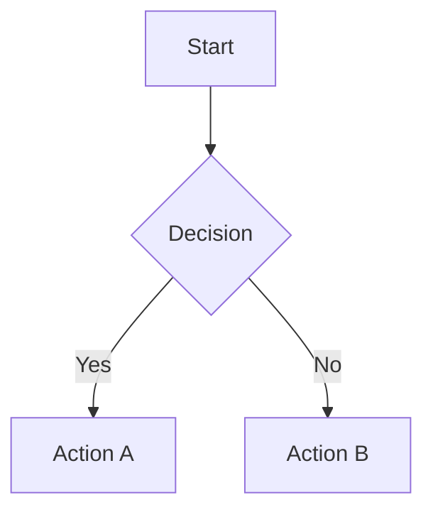

# Markdown & Rendering

Local Comment provides complete Markdown support, including in-editor comments, Markdown file preview, and export.

## Markdown File Preview & Export {#file-preview}

**New in v2.0**: Directly preview and export `.md` files, deeply integrating documents with code:

### Preview Markdown Files

- In any `.md` file editor, **right-click and select "Preview Markdown"**
- Or run `Local Comment: Preview Markdown` from the Command Palette
- Supports live rendering: Mermaid diagrams, LaTeX formulas, syntax-highlighted code
- Diagram interactions: Zoom buttons (+/-), <kbd>Ctrl</kbd> + scroll to zoom, mouse drag to pan

### Export to HTML

- Click the "Export HTML" button in the preview panel
- Generates a **self-contained HTML file** (with inlined CSS/JS/font resources)
- Viewable offline, perfect for sharing and archiving

### Reference Code Tags in Documents

You can reference tags from code in Markdown files, linking documents to code:

```markdown
## System Architecture

Configuration loading module: @configLoader
Error handling module: @errorHandling
```

- Right-click → "Insert tag reference" to quickly insert `@tagName`
- Click `@tagName` in preview to **jump directly to the code definition**

<div class="callout callout-tip">
<strong>Knowledge management workflow:</strong> Write design docs in Markdown → Reference code tags with <code>@</code> → Preview in one click → Export HTML to share with the team. All tag links remain clickable after export.
</div>

## Syntax Reference {#syntax}

### Basic Syntax

| Element | Markdown Syntax |
|---------|-----------------|
| Heading | `# H1` `## H2` `### H3` |
| Bold | `**bold**` |
| Italic | `*italic*` |
| Quote | `> quoted content` |
| Ordered list | `1. First item` |
| Unordered list | `- First item` |
| Code | `` `code` `` |
| Code block | ` ```js\ncode\n``` ` |
| Link | `[title](url)` |
| Image | `` |
| Divider | `---` |
| Table | `\| A \| B \|` |

## Mermaid Diagrams {#mermaid}

Use ` ```mermaid ` code blocks to insert flowcharts:

```markdown

```

<div class="callout callout-tip">
<strong>Advanced tip:</strong> In the preview area, you can use <kbd>Ctrl</kbd> + mouse wheel to zoom Mermaid diagrams. Hand-drawn style is supported (can be switched in settings).
</div>

## LaTeX Formulas {#latex}

Use `$$` to wrap LaTeX formulas:

```markdown
$$
E = mc^2
$$
```

Inline formulas use `$...$`:

```markdown
This is an example of an inline formula $a^2 + b^2 = c^2$.
```

## Code Highlighting {#highlight}

Code blocks support syntax highlighting; specify the language in the fenced code block:

```markdown
```javascript
function hello() {
  console.log("Hello");
}
```
```

Supported languages include but are not limited to: javascript, typescript, python, java, cpp, html, css, json, yaml, bash.

## Theme Configuration {#theme}

In VS Code: settings, search for "local comment" to adjust:

- **Markdown preview font size:** Follows editor font size by default
- **Code highlighting theme:** Multiple themes available
- **Mermaid theme:** Default, hand-drawn, and other styles

<div class="callout callout-tip">
<strong>Daily configuration:</strong> If you frequently use Mermaid, it is recommended to try the "hand-drawn" style to make flowcharts look more relaxed.
</div>
